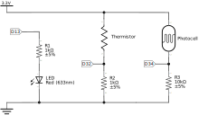

# ESP32-asyncServer-data
This repository contains an implementation of an asynchronous HTTP webserver for an ESP32 microcontroller. The ESP32, connected to a WiFi network, is used to control a LED and read and process the values from a thermistor and a photoresistor. The control and values are sent to the clients connected to the webserver using websockets.

Apart from the Async server and websockets, the following technologies are used:
- [JSON](https://www.json.org/json-en.html) data format is used as standard.
- [charts.js](https://www.chartjs.org/) for data presentation.
- [Bootstrap](https://getbootstrap.com/), the CSS framework, decorates the webpages.

## Schematic
The following parts have been used in the electronic circuit. Nevertheless, they can be replaced for other similar ones with little change in the code.
- 1x LED.
- 1x MF52D NTC thermistor.
- 1x photoresistor.
- 2x 1 k&#8486; resistances.
- 1x 10 k&#8486; resistance.

ESP32 pins in the schematic are referred as 3.3V, GND and D*.

## Requirements
ESP32 libraries:
- [WiFi.h](https://github.com/espressif/arduino-esp32/tree/master/libraries/WiFi)

External libraries:
- [AsyncTCP](https://github.com/me-no-dev/AsyncTCP). Async TCP Library for ESP32.
- [ArduinoJson](https://arduinojson.org). JSON library for embedded C++.
- [ESPAsyncWebServer](https://github.com/me-no-dev/ESPAsyncWebServer). Async HTTP and WebSocket Server.

## Usage
1. Connect the ESP32 as showed in the schematics.
2. Install the standard ESP libraries either using the Arduino IDE or directly from [Espressif](https://docs.espressif.com/projects/esp-idf/en/latest/esp32/).
3. Install the required external libraries.
4. Download the repository and rename the file *constants.h.TEMPLATE* to *constants.h*.
    - Change the SSID and PASSWORD correspoding to the WiFi network. 
5. Flash the ESP32:
    - For VSCode, modify the *arduino.json* and *c_cpp_properties.json* files to add the missing libraries.
    - For the Arduino IDE, change the *src* folder to match the name of the *.ino* file.

## License
[GPL-3.0](https://choosealicense.com/licenses/gpl-3.0/)